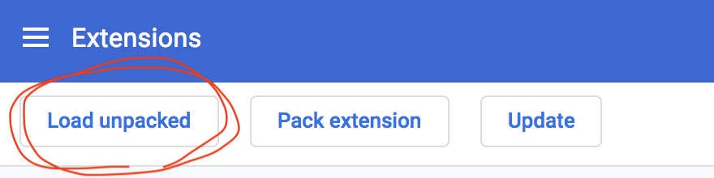
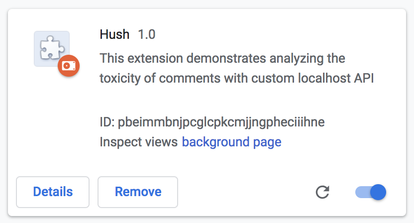

---
# INSTALLATION
### Minimal
This installation method gets you up and running with the Flask-RESTful server backend and the Chrome extension. If you want to train your own models, follow the Training installation method.
- Clone the repository and then `cd` into `src/`.
- (Optional) Create a virtual environment and activate it.
- Install requirements via `pip install -r requirements_backend.txt`.
- Download the trained models via `python download_models.py`.
- Open Chrome and under "Extensions", enable developer mode.

  

- Click "Load unpacked". 

Navigate to `src/` and load the folder `chrome_extension`. You should see "Hush 1.0" now present as an unpacked extension. You can now exit developer mode if you wish.

- Refer to the USAGE section for further instructions.

### Training
This installation method will allow you to train your own models using the scripts present in `src/model_training/`. 
- Follow the Minimal installation method. You can skip downloading the trained models and installing the extension in Chrome if you wish.
- Install the requirements via `pip install -r requirements_training.txt`.
- Either download the FastText and GloVe models yourself or use `bash download_embedding_models.sh`. 

# USAGE
Once you have completed the Minimal installation steps, `cd server_backend/` and run `python flask_rest_server.py`. Once you see the message "Happy filtering!", navigate in Chrome to a supported web page (currently: Twitter, Telegraph, 4chan, Nextdoor) and click the toxicity icon to the right of the URL bar. If the webpage is supported, hovering over the icon for a few seconds will display the text "Has access to this site". 

Once the extension has detected comments, you can adjust the slider to your preference. If a toxic comment is detected, a blurred overlay will hid the comment. Click the comment to display it and click again to hide the comment.

You can display all comments by either clicking the "X" symbol in the top right of the panel or by clicking the toxicity icon. Click the toxicity icon again to reactivate the filter.

You can move the displayed panel by clicking and dragging the "+" symbol in the top right.

Click on "info ^" in the top right to display a drop-down menu with links to supported websites as well as a query form. Type in a comment into the form box and click the "Predict Toxicity" button to receive a toxicity rating for your input. Click the "info" button in the top right again to hide the menu.

---
# TODO
### CURRENT BUGS
- On Twitter, form box queries result in a server unresponsive message regardless of server state.
- Sometimes extension button has to be clicked twice to actually load. Should be problem with how tab events are being handled in background.js.
- Twitter sluggish af. Probably need to decrease number of queries.

### FEATURES TO BE ADDED
- [UI]: Color change on filter/header w/ toxicity of comment.
- [UI]: Adapt color scheme to current website
- [UI]: resizable panel
- [UI]: ability to reset panel position
- [backend]: only make server query when a comment has changed
- [backend]: Add more websites: youtube, reddit, facebook
- [backend]: Cache already seen comments using flask cache.
- [longterm]: Interactive learning -- users can provide feedback when type 1 & 2 errors occur, models should adapt.
  - Keep base models, add new adaptive models to committee with more weight in decision process?

### IDEAS & MISC
- Offload GRU models to client side and let server handle embeddings?
- Is there a way to make embedding more efficient? 
- Is there a way to make preprocessing more efficient?

